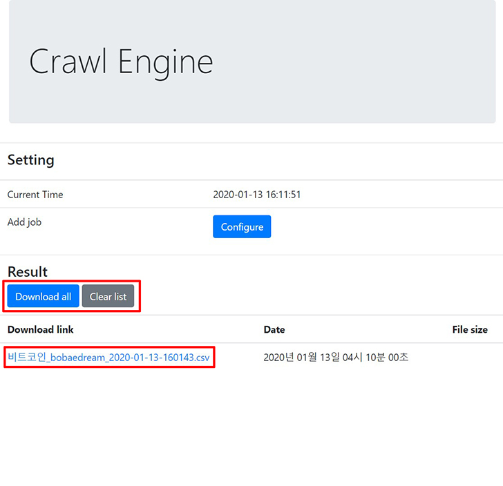

# Pipeline Crawler

처음에는 단순 커뮤니티, SNS, 포털사이트 크롤 용도로 로컬에서만 사용하도록 제작했습니다. 그러다 추출해야할 데이터의 양이 증가하다보니 ElasticSearch로 데이터를 보내는 데 중점을 두고 클라우드 환경에서도 사용이 가능하도록 튜닝을 해왔습니다.

## Outline

- [Installation](#Installation)
- [Scripts](#Scripts)
- [Usage](#Usage)
- [Features](#Features)
- [Output](#Output)

## Installation

- 의존성 패키지를 설치합니다.

  ```sh
  // using yarn
  yarn

  // using npm
  npm install
  ```

- `update.sh`에서 원격저장소 주소를 수정합니다.

  ```sh
  git remote set-url origin <GIT_REPO_URL>
  ```

- `.env`를 수정합니다.

  - 배치잡용 옵션으로 머신의 성능에 따라 최대 브라우저 갯수를 설정이 가능합니다. 단, http 통신으로 요청을 보내서 크롤할 때만 가능합니다. EC2 t2.medium(2core/4gb)에서는 `MAX_BROWSER_COUNT`가 1이 적합했습니다. 그 이상은 memory leak 문제가 생깁니다.

    ```.env
    # Puppeteer options
    MAX_BROWSER_COUNT=<NUMBER>
    ```

  - ElasticSearch를 구동시키고 있는 URL을 입력합니다.

    ```.env
    # ElasticSearch URL
    ES_URL=
    ```

  - AWS 프로파일 정보와 SQS에서 `fifo`옵션으로 만든 Queue URL, 그리고 S3 버킷명을 입력합니다.

    ```.env
    # Aws configuration
    ACCESS_KEY_ID=<ACCESS_KEY_ID>
    SECRET_ACCESS_KEY=<SECRET_ACCESS_KEY>
    REGION=<REGION>
    QUEUE_URL=<QUEUE_URL>
    BUCKET_NAME=<BUCKET_NAME>
    ```

  - 커뮤니티 계정을 입력합니다.

    ```.env
    # Naver
    NAVER_ID=<NAVER_ID>
    NAVER_PW=<NAVER_PW>

    # Instagram
    INSTA_ID=<INSTA_ID>
    INSTA_PW=<INSTA_PW>
    ```

- `outputs` 디렉토리를 생성합니다.

  ```sh
  $ mkdir outputs
  ```

<br>

---

<br>

## Scripts

- `npm start` / `yarn start`: 프로덕션 모드로 서버 구동
- `npm run start:dev` / `yarn start:dev`: 개발 모드로 서버 구동
- `npm run start:bat` / `yarn start:bat`: 배치잡 모드로 서버 구동
- `sh update.sh`: 원격저장소에서 가장 최신버전 코드 다운로드 및 설치
- `sh start.sh`: 배치잡용 pm2 재실행 스크립트

<br>

---

<br>

## Usage

#### 프로덕션 모드

개발모드와의 차이점은 `healess`옵션이 켜졌냐 꺼졌냐의 차이만 있습니다. `80`번 포트를 사용합니다.


`Configure`를 눌러 설정창을 띄웁니다.


`keyword`, `channel`, `job scheduling`, `start date`, `end date`을 설정합니다.


`Send`를 클릭하면 위와 같은 alert창이 발생합니다.


추출이 완료되면 `Result`블록 아래서 결과물을 직접 다운받을 수 있습니다. 복수의 파일이라면 `Download all`을 통해 받을 수 있으며, 단수의 파일이라면 파일 다운로드 링크를 클릭하면 받을 수 있습니다. `Clear list`를 통해 리스트가 꽉차면 리스트를 비울 수 있습니다.

#### 개발 모드

주로 디버깅 작업을 해야하기 때문에 `healess`옵션을 꺼둔채로 사용합니다. `8080`번 포트를 사용합니다.

#### 배치잡 모드

크롤러를 클러스터화해서 사용하기 적합하도록 튜닝한 모드입니다. [여기]()에서 데이터 파이프라인을 확인하실 수 있습니다.

- 한 행의 데이터를 추출할 때마다 ElasticSearch로 한 줄씩 보내고 있습니다.
- 빠른 서버 재실행과 로그 기록을 위해 pm2를 사용하고 있습니다. `ecosystem.json`을 확인해주세요.

<br>

---

<br>

## Features

- 키워드는 `컴마+공백`을 구분자로 입력합니다.
  - 예: `비트코인, 리플, 이더리움`
  - 인스타그램 모델에서는 hashtag 검색에 공백이 허용되지 않으므로, 공백은 자동으로 `replace()`처리가 되도록 했습니다.
    - 예: `네이버 블로그` => `네이버블로그`
- `Add crawling job` 컴포넌트에서 `Job scheduling`에 추출을 원하는 시간을 입력하면 작업 예약이 가능합니다.
- 배치잡 모드 사용을 위해 웹소켓 통신을 하는 프론트엔드 뿐만 아니라 rest api를 사용합니다.

  - `GET /crawl`: 잡을 받을지 말지 결정해서 서버리스 코드에 돌려줍니다.

    - 응답코드

      - 크롤이 불가능한 경우

        ```json
        { "success": false }
        ```

      - 크롤이 가능한 경우
        ```json
        { "success": true }
        ```

  - `POST /crawl`: 잡을 받을 상태가 되었다면 body에 추출할 정보를 실어서 보냅니다. 한 행씩 추출이 끝날 때마다 ElasticSearch에 추출한 정보를 업로드합니다.

    - 필수 입력 필드: `keyword`, `startDate`, `endDate`, `site`, `category`, `channel`
    - 응답 코드

      ```json
      { "success": true }
      ```

<br>

---

<br>

## Output

- csv파일로 아래와 같은 필드명으로 `outputs`디렉토리에 추출후 저장됩니다.

  | keyword | category | date | title | username | content | click | link | channel | site |
  | ------- | -------- | ---- | ----- | -------- | ------- | ----- | ---- | ------- | ---- |
  | KEYWORD | CATEGORY | DATE | TITLE | USERNAME | CONTENT | CLICK | LINK | CHANNEL | SITE |
